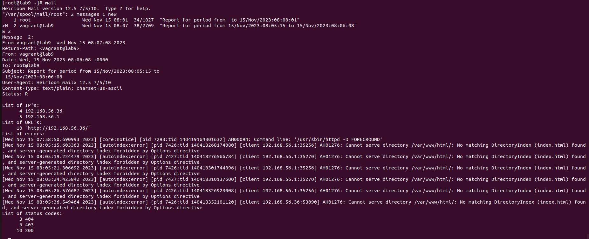

# Домашнее задание №9 "Пишем скрипт"

## написать скрипт на языке Bash

## Задания:
Написать скрипт для CRON, который раз в час будет формировать письмо и отправлять на заданную почту.
Необходимая информация в письме:
1. Список IP адресов (с наибольшим кол-вом запросов) с указанием кол-ва запросов c момента последнего запуска скрипта;
1. Список запрашиваемых URL (с наибольшим кол-вом запросов) с указанием кол-ва запросов c момента последнего запуска скрипта;
1. Ошибки веб-сервера/приложения c момента последнего запуска;
1. Список всех кодов HTTP ответа с указанием их кол-ва с момента последнего запуска скрипта.
1. Скрипт должен предотвращать одновременный запуск нескольких копий, до его завершения.
1. В письме должен быть прописан обрабатываемый временной диапазон.

## Решение:
1. При выполнении `vagrant up` разворачивается система с веб сервером в копируется файл скрипта [InfoToEmail.sh](./InfoToEmail.sh), а затем выполнятеся [скрипт](./script.sh).
1. [Скрипт](./script.sh) выполняет следующие действия:
    - устанавливает требуемые пакеты.
    - настраивает cron для ежечастного выполнения скрипта.
    - Запускает сервисы.
    - В результате мы получаем систему, которая ежечастно отправляет отчеты на основе информации в логах web сервера access_log и error_log.
1. Скрипт [InfoToEmail.sh](./InfoToEmail.sh) выполняет следующие действия:
    - Готовит информацию о временно интервале отчета.
    - Создает список из 3 наиболее активных IP адресов.
    - Создает список из 3 наиболее часто запрашиваемых URL.
    - Формирует список всех ошибок веб сервера за указанный интервал времени.
    - Формирует список всех кодов HTTP ответа с указанием их кол-ва за указанный интервал времени.

## Результат:
1. Выполнены все задания по созданию скрипта. 
1. Для предотвращения одновременного запуска использован flock
1. Подготовлен vagrantfile с настроенным cron и сервисами. 
1. Подготовлены результы выполнения д.з.:

| <!-- -->      | <!-- -->        | 
|:-------------:|:---------------:|
|Письмо с отчетом ||